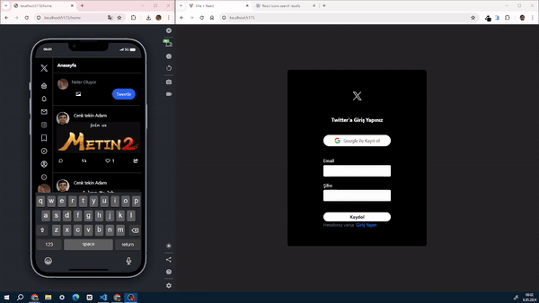

### Twitter Clone
- Ekran Görüntüsü

- Canlı Link

## Kullanılan Teknolojiler ve Kütüphaneler

- **React.js**: Kullanıcı arayüzünü oluşturmak için kullanılan JavaScript kütüphanesi.
- **Firebase**: Projemde Firebase'i entegre ettim. Firebase, sunduğu çeşitli bulut tabanlı hizmetlerle projenin gelişimini hızlandırdı. Özellikle Firebase Authentication ile kullanıcı kimlik doğrulamasını, Cloud Firestore ile veritabanı yönetimini ve Firebase Storage ile dosya depolamasını kolayca entegre ettim.
- **React Router DOM**: Sayfa yönlendirmesi ve yönetimi için kullanılan bir kütüphane.
- **React Toastify**: Kullanıcı dostu bildirimler göstermek için kullanılan bir kütüphane.
- **React Icons**: İkonları projeye entegre etmek için kullanılmıştır.
- **Moment**: Tarih ve saat manipülasyonu için kullanılan bir kütüphane.
- **UUID**: Benzersiz tanımlayıcılar oluşturmak için kullanılmıştır.
- **Tailwind CSS**: Web sitesinin tasarımını geliştirmek için kullanılan bir CSS kütüphanesi.

# Yetkilendirme 
- Authentication (Kimlik Doğrulama): Kullanıcının kimliğini doğrulama sürecidir Kuladi şifre,touchid,faceid  google hesabı kullanarak kullanıcının kimliği doğrulanabilir.

# Authorization (Yetkilendirme) 
-  Kullanıcın sistemin kaynaklarına işlevlerine sayfalarına erişim izni verme veya redetme  sürecidir,
- Authentication başarılı olduktan sonra Kullanıcının ne kadar erişime sahip olduğunu belirleme sürecidir

# Firebase Metotları

# getAuth ve getAuth().currentUser
- Mevcut kullanıcıyı döndürür veya oturum açılmadıysa null döndürür.
Bu yöntem, mevcut oturumun kullanıcı bilgilerine anlık olarak erişmek için kullanılır. Örneğin, kullanıcının adını, e-posta adresini veya diğer kullanıcı bilgilerini almak için kullanılabilir.
Bu yöntem senkron olarak çalışır ve anlık kullanıcı bilgilerini döndürür.
# onAuthStateChanged :
-  getAuth  ile render edilen currentuser gibi veriler  asenkron olarak gerçekleşir. Dolayısıyla, currentUser özelliğini hemen kullanmadan önce Firebase Authentication işleminin tamamlanmasını beklememiz gerekir ve getAuth sadece kullanıcı oturum açtığında bir seferliğine tetiklenir .Bundan sebep Authentication işleminin tamamlanmasını beklemek tek seferliğine çözüm olsada sayfa yenilendiğinde getauth tetiklenmediğinden ( Kullanıcı girişi olmadığı için ) currentuser verileri null döner .Buda Render işleminin gerçeklememesine yada  hataya sebep olur.

- Kullanıcının oturumunun değişmini anlık izleyen onAuthStateChanged metodu sayesinde kullanıcının kimlik doğrulama durumunda (authentication state) herhangi bir değişiklik olduğunda bildirim almak için bir dinleyici (listener) eklemektir.

- Yani, kullanıcı giriş yaptığında, çıkış yaptığında veya oturum durumu değiştiğinde (örneğin, kullanıcı hesabını sildiğinde), bu metot tetiklenir.Genellikle bir kez çağrılır ve uygulama boyunca kullanıcı oturum durumunu izlemek için kullanılır. Bu özell ile oturum durumuna göre uygun eylemleri gerçekleştirmek için oldukça kullanışlıdır.

- - Performans odaklı  authentication izleme 
- onAuthStateChanged metodunu  sayfa ilk render olduğunda çalıştırırız. Kullanıcının sayfayı görüntülendiği anda kullanıcı oturumu izlenmeye başlanır ve veriler useState ile tutulur.

- onAuthStateChanged metodu sürekli çalışan bir metot oldugundan Kullanıcı sayfadan ayrıldıgında dahi çalışmaya devam edebiliyor .Bunun için unsubscribe diye bir metot barındırır ve daha iyibir Optimizasyon için   useEffect ile  componentdidMount ile çalıştırmasını   componenetWillUnmount anında ise unsubs metodunu ile kullanıcının oturum izlemesini durdurabiliriz 

# getFirestore
- firebase'de Oluşturulan CloudFirestore Nosql veritabanının referansını almaya yarar ve bu veritabanında okuma, yazma, sorgulama ve dinleme gibi işlemleri gerçekleştirmek için kullanılır.

# addDock 

- addDoc (veya add) metodu, Firestore veritabanına belge (document) eklemek için kullanılan bir metottur. Bu metot, belirli bir koleksiyona yeni bir belge eklemek için kullanılır.

- Örneğin, bir kullanıcının bilgilerini içeren belgeleri users adlı bir koleksiyona eklemek istediğinizi düşünelim. Bu durumda, addDoc yöntemini kullanarak yeni bir kullanıcı belgesi ekleyebilir ve  Bu metod ;  belirtilen koleksiyona yeni bir belge ekler ve eklenen belgenin referansını döndürür. Bu referans, belgeye erişmek veya belgeye başvurmak için kullanılabilir.